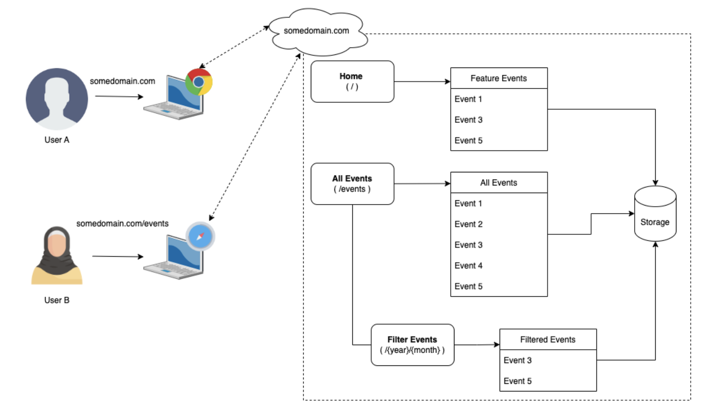

# Community Events App

A simple app that give you a glance on how to develop a full-fledge web-based application using [NextJS](https://nextjs.org).
As the name implies, the application itself is an app that shares some events held by the communities around you.
This application was intentionally prepared for my NextJS foundation class training.
You are free to use all of the provided materials. Grab the training slides from [here](public/docs/NextJS-Foundation-Class.pdf).

## Context Diagram (HLD)



## Prerequisites

1. Docker
2. NodeJS

## Run the Application

1. Run mongodb container

```bash
docker container run -d --name localmongo -e MONGO_INITDB_ROOT_USERNAME=mongoadmin -e MONGO_INITDB_ROOT_PASSWORD=secret -p 27017:27017 mongo
```

2. Run the development server:

```bash
npm run dev
# or
yarn dev
# or
pnpm dev
# or
bun dev
```

Open [http://localhost:3000](http://localhost:3000) with your browser to see the result.
